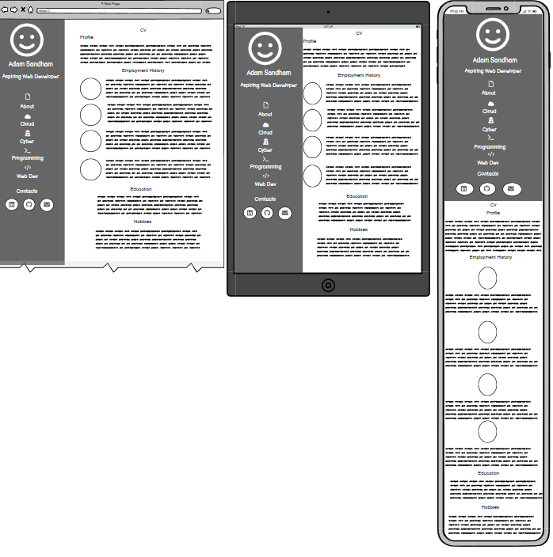
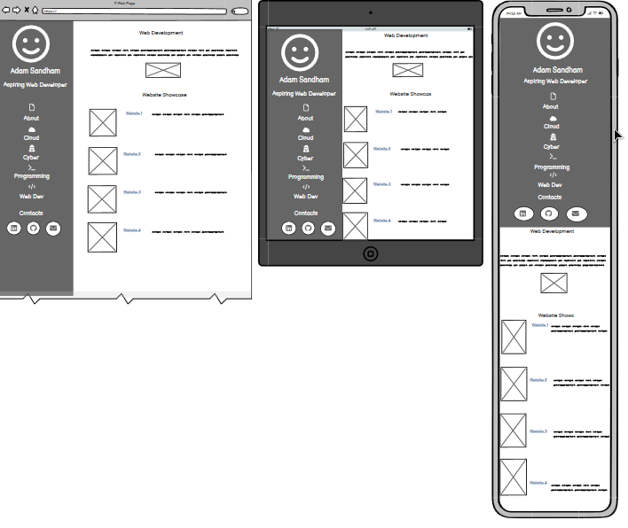

# Adam Sandham Portfolio
(Developer: Adam Sandham)

[Live webpage](https://sandham-a.github.io/portfolio_cv.html)

## Table of Content

1. [Project Goals](#project-goals)
    1. [User Goals](#user-goals)
    2. [Site Owner Goals](#site-owner-goals)
2. [User Experience](#user-experience)
    1. [Target Audience](#target-audience)
    2. [User Requrements and Expectations](#user-requrements-and-expectations)
    3. [User Stories](#user-stories)
3. [Design](#design)
    1. [Design Choices](#design-choices)
    2. [Colour](#colours)
    3. [Fonts](#fonts)
    4. [Structure](#structure)
    5. [Wireframes](#wireframes)
4. [Technologies Used](#technologies-used)
    1. [Languages](#languages)
    2. [Frameworks & Tools](#frameworks-&-tools)
5. [Features](#features)
6. [Testing](#validation)
    1. [HTML Validation](#HTML-validation)
    2. [CSS Validation](#CSS-validation)
    3. [Accessibility](#accessibility)
    4. [Performance](#performance)
    5. [Device testing](#performing-tests-on-various-devices)
    6. [Browser compatibility](#browser-compatability)
    7. [Testing user stories](#testing-user-stories)
8. [Bugs](#Bugs)
9. [Deployment](#deployment)
10. [Credits](#credits)
11. [Acknowledgements](#acknowledgements)

# Project Goals

## User Goals
- Finding a website about me and my body of work.
- For users to have a more detailed CV.
- Users to see the projects that I have been working on.

## Site Owner Goals
- To show visitors an example of the various technologies that I use and examples of my work.
- To allow myself to show a full digital CV which isn’t constrained by being two A4 Pages.
- To have a centralized directory as a means to showcase websites that I have built.

# User Experience

## Target Audience
- People that are looking to hire me.
- People interested in my projects that I have done.
- People that are looking for validation for claims on my CV.

## User Requirements and Expectations
- That navigation of the site is easy and intuitive and that all navigation takes place within the site and that the website and should be only one click away.
- Quickly and easily find relevant information depending on what they are planning to hire me for
- That links and functions work as expected
- Visually appealing presentation as this website also serves to showcase my web development skills especially in relation to front end development
- An easy way to contact me 
- That the information is accessible to all

# User Stories

## First-time User
1. As a first time user, what are Adam’s skillset is and what level he is ability is at.
2. As a first time user, I want to see examples of Adam’s programming skills as he stated  show in project he’s done.
3. As a first time user, I want examples of website’s he has created.
4. As a first time user, I want to know the qualifications that Adam has.

## Returning User
5. As a returning user, I want to see Adam’s complete CV.
6. As a returning user, I wish to revisit the projects Adam has done.
7. As a returning user, I want to get in contact with Adam through email. 
8. As a returning user, I want to see Adam’s public git hub repository. 
9. As a returning user, I want to see Adam’s linkedin profile.
10. As a returning user, I want to see the websites Adam has made.

## Site Owner
11. As the site owner, I want to show that I can professional quality websites.
12. As the site owner, I wish to show potential employers that I am professional.
13. As the site owner, I want users to find out users about me and my skill set.
14. As the site owner, I want users to see the projects I’ve done.
15. As the site owner, I want the users to be able to contact me about. 

# Design

## Design Choices
When designing the website, I was consciously aware that the previous bootstrap project was a portfolio website and would need to be very distinct from my own website. The website is designed to show case my various IT skills it would have to be clear, concise and look professional.

## Colour
As dark blue is my favourite colour, I decided that would be the central colour as to base my website on. I used shecodes pallets which give me a pallet of complementary colours that work together and the hexadecimal values for the pallet of my choosing. 

## Fonts
I used exo font as it is a standard font for most corporate websites as it is clean and simple. The font is considered dyslexia friendly.

## Structure
As stated before I was very aware of the previous project being a portfolio website and needed to make sure that it did not look like a rehash of that. Having researched recommended portfolio sites
I decided to do a vertical header rather than a standard horizontal one for 3 reasons - 

1. The number of pages I needed mean that I doubted I'd come up with a layout that looked busy and cluttered. 
2. In the future with more time and when my skills have improved I can create collapsible subheadings to make navigation around the site even more precise. 
3. The layout means that the navigation of my site means that I can go to any page from any other page and that a users is only one click away from any page on the site.

The page is structured, uniform, intuitive and simple to pick up. 
The website consists of 7 pages

- An index page with a form to get in contact with me.
- A CV page that showcases my complete CV and allows for user interactivity with me highlighting the companies that I have worked for.
- A cloud computing page showcasing my cloud qualifications and plans to spin up a cloud server to launch this site in the future.
- A cyber security page explaining my educational background in cyber security, show the qualifications that I have and eventually and CTF articles that I write.
- A programming page that showcase little programming projects that I have done in the past. Eventually the links will run a modal that runs the program but this falls outside the scope of this project.
- A web development page that shows the websites that I have built or worked through. 
- A page for when a 404 error occurs. 

# Wireframes

Index

CV

Cloud

Cyber

Programming

Web Development

# Technologies Used

## Languages
- HTML
- CSS

## Frameworks & Tools
- Bootstrap v5.0
- Git
- GitHub
- Gitpod
- Google Fonts
- Font Awesome
- Balsamiq

# Features

The page consists of seven pages
- Navigation Bar
- About Me/ CV
- Cloud computing page
- Cyber Security Page
- Programming Page
- Web Development Page
- Contact Form

# Validation

## HTML Validation
The W3C Markup Validation Service was used to validate the HTML of the website. All pages pass with no errors no warnings to show.

## CSS Validation
The W3C Jigsaw CSS Validation Service was used to validate the CSS of the website. The CSS page returned no errors. 

## Accessibility
The WAVE WebAIM web accessibility evaluation tool was used to ensure the website met high accessibility standards. All pages pass with 0 errors.

## Performance
Google Lighthouse in Google Chrome Developer Tools was used to test the performance of the website. And scored 70+ in all areas

Performing tests on various devices
The website was tested on the following devices:
- 2 different home built PC's
- Samsung Galaxy Tab A tablet
- ASUS Vivobook K553EA

In addition, the website was tested using Google Chrome Developer Tools Device toggling option for all available device options.

## Browser compatability
The website was tested on the following browsers:
- Google Chrome
- Mozilla Firefox
- Microsoft Edge
- Opera GX

# Testing user stories

# Bugs
Bug	Fix
A blue boarder would appear on the right of the screen which was acceptable on a monitor but on smaller devices took up a lot of space. This required 
Layout of CV is messy when file size shrinks to 786px and required the justified content to be over ridden and the padding for the text to look in line.
Email overflows on xs screen size	Add a media query that makes the divs spread to 100% width on xs sreens to froce the content onto a seperate line
When viewed on tablets, the contact page has whitespace after the footer	Set min-height for body to 100vh
Deployment

The website was deployed using GitHub Pages by following these steps:
1.	In the GitHub repository navigate to the Settings tab
2.	On the left hand menu select Pages
3.	For the source select Branch: master
4.	After the webpage refreshes automatically you will se a ribbon on the top saying: "Your site is published at <a href="https://sandham-a.github.io/portfolio_cv.html"> 
https://sandham-a.github.io/portfolio_cv.html</a>  

You can for fork the repository by following these steps:
1.	Go to the GitHub repository
2.	Click on Fork button in upper right hand corner

You can clone the repository by following these steps:
1.	Go to the GitHub repository
2.	Locate the Code button above the list of files and click it
3.	Select if you prefere to clone using HTTPS, SSH, or Github CLI and click the copy button to copy the URL to your clipboard
4.	Open Git Bash
5.	Change the current working directory to the one where you want the cloned directory
6.	Type git clone and paste the URL from the clipboard ($ git clone https://github.com/YOUR-USERNAME/YOUR-REPOSITORY) 7.Press Enter to create your local clone.

# Credits
Images not referenced below are owned by the developer.
Media
In order of apearance:
-   [Portrait-Image](./assets/images/hero-image.jpg) : was an internal photo at <a href="www.risual.com">Risual</a>
-   [Site-logo](./assets/images/gamespy_logo.jpg) : was an image taken from <a href="www.gamespy.com">Gamespy's final article</a>
-   [Risual-logo](./assets/images/CV/risual_logo.png) : was an image taken from <a href="www.risual.com">risual.com<a>
-   [DIO-logo](./assets/images/CV/DIO_logo.jpg) : was an image taken from the DIO's own <a href="[www.wikipedia](https://en.wikipedia.org/wiki/Defence_Infrastructure_Organisation)">
    wikipedia article<a>
-   [With-you-with-me-logo](./assets/images/CV/WYWM_logo.jpg) : was an image taken from WYWM's <a href="https://www.facebook.com/withyouwithme1/">facebook</a> page
-	[Royal-Corp-Of-Signals-logo](./assets/images/CV/signals_logo.png) : was an image taken from the Royal Single's own <a href="https://en.wikipedia.org/wiki/Royal_Corps_of_Signals">
    wikipedia<a>
-   [Delice-de-France-logo](./assets/images/CV/delice_de_france_logo.png) : was an image taken off the <a href="https://www.bacoffice.co.uk/case-study/delice-de-france/"> BAC's <a>
    case study.
-   [Staffordshire-fire-logo](./assets/images/CV/staffordshre_fire_and_rescue_logo.png) : was an image taken off Staffordshire Fire and Rescues's 
    <a href="https://www.staffordshirefire.gov.uk/"> website </a>

Code
In order of appearance:
- The contact links are copied from code institute's Rosie's portfolio and then altered to suit what I needed them to do. 
- The form was also copied from Rosie's Portfolio. 

# Acknowledgements
I would like to take the opportunity to thank:
-	My mentor Mo Shami for his feedback, advice, guidance and support.
-	My girlfriend Nicola for allowing me time to do this project with my precious weekends with her.
-	To the lovely people on the Code Institute Slack for providing peer code reviews and help with some of my trickier problems.
-	My parents who own gave me child free time to work on this project.

